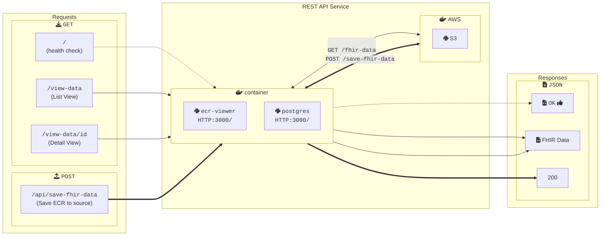
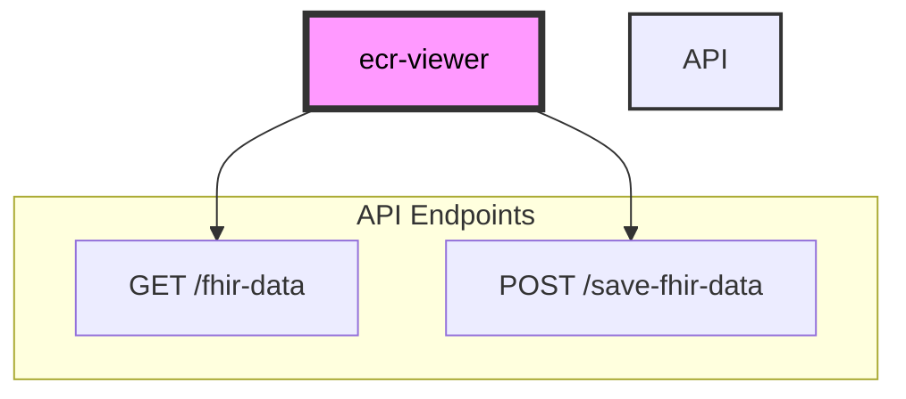

# Getting Started with DIBBs eCR Viewer

## Introduction

The DIBBs eCR Viewer service offers a REST API for processing eCR FHIR messages into an HTML page that displays key information in a readable format and makes specific data fields easy to find.

## Running eCR Viewer

You can run the eCR Viewer using Docker, any other OCI container runtime (e.g., Podman), or directly from the source code.

### Running with Docker (Recommended)

To run the eCR Viewer with Docker, follow these steps.

1. Confirm that you have Docker installed by running `docker -v`. If you don't see a response similar to what's shown below, follow [these instructions](https://docs.docker.com/get-docker/) to install Docker.

```
❯ docker -v
Docker version 20.10.21, build baeda1f
```

2. Download a copy of the Docker image from the PHDI repository by running `docker pull ghcr.io/cdcgov/phdi/ecr-viewer:latest`.
3. Run the service with `docker run -p 8080:8080 ecr-viewer:latest`.

Congratulations, the eCR Viewer should now be running on `localhost:8080`!

### Running from Node.js Source Code

We recommend running the eCR Viewer from a container, but if that isn't feasible for a given use-case, please see the [Development section](##Development) for instruction to run the eCR Viewer locally

## Building the Docker Image

To build the Docker image for the eCR Viewer from source instead of downloading it from the PHDI repository follow these steps.

1. Ensure that both [Git](https://git-scm.com/book/en/v2/Getting-Started-Installing-Git) and [Docker](https://docs.docker.com/get-docker/) are installed.
2. Clone the PHDI repository with `git clone https://github.com/CDCgov/phdi`.
3. Navigate to `/phdi/containers/ecr-viewer/`.
4. Run `docker build -t ecr-viewer .`.

## Non Integrated Viewer

To enable the Non Integrated Viewer homepage, set the environment variable `NEXT_PUBLIC_NON_INTEGRATED_VIEWER` equal to `true`. This will enable the Non Integrated viewer homepage at `localhost:3000/ecr-viewer`.

For local development, if `NEXT_PUBLIC_NON_INTEGRATED_VIEWER` is not set equal to `true` on `.env.local`, convert-seed-data will not seed the metadata.

## Potential Issues

If you have problems connecting to your database, use this command to see what other postgres databases might be running
`sudo lsof -i :5432`. If anything is using that port, kill it using: `kill {pid}`

If building the Docker Image doesn't work as expected, try to first run the eCR Viewer locally using the steps below.

If you consistently encounter the error message `"ecr_viewer_db" does not exist` when attempting to run the app, there could be conflicting databases running on port 5432 as part of other background processes. Try pruning any dangling Docker images and containers (`docker image prune` and `docker container prune`). If issues persist, try logging into `psql` on the command line to see what databases are running there.

## Development

### Run eCR Viewer Locally

To run the eCR Viewer locally:

1. Ensure that Git, Docker, and Node (version 18.x or higher) are installed.
2. Clone the PHDI repository with `git clone https://github.com/CDCgov/phdi`.
3. Navigate to `/phdi/containers/ecr-viewer/`.
4. Install all of the Node dependencies for the eCR Viewer with `npm install`.
5. Setup your `.env.local` by running `npm run setup-local-env`.
6. Create seed data with `npm run convert-seed-data` - this will take ~10 minutes. Note that this process will fail immediately if the Docker daemon isn't running.
7. Run the eCR Viewer on `localhost:3000/ecr-viewer` with `npm run local-dev`.

### Windows Setup

The eCR Viewer is primailly deveoped on Mac silicon machines, See this [integreation testing wiki page](https://github.com/CDCgov/phdi/wiki/Integration-Testing#running-integration-tests-locally-on-windows) for additional infomation for running on Windows machines.

### Updating Seed Data

Sample eICRs are included in `containers/ecr-viewer/seed-scripts/baseECR/`. If you ever need to update the eCRs or add new eCRs you can regenerate the data by:

1. Delete the current volume used by your DB: `docker compose -f ./docker-compose.yaml --profile "*" down -v`
2. Run `npm run convert-seed-data` to re-run the FHIR conversion of the seed eCRs
3. Run `npm run local-dev` to re-run the eCR Viewer with the newly converted data.

By default, the seed data in the `LA` subfolder converts. To convert other (or additional) subfolders, set the `SEED_DATA_DIRECTORIES` environment variable to a comma delimited list of subfolders (e.g. `LA,Dir2` or `Dir2`).

### Developer Commands

Additional commands can be found in [`package.json`](package.json).

### Testing

#### Unit Testing

Unit tests utilize Jest as the test runner. [Jest-axe](https://github.com/nickcolley/jest-axe) provides basic accesibility utilities and [React testing library](https://testing-library.com/docs/react-testing-library/intro) provides react utilities.
Running tests:

- `npm run test` - Run the full suite of unit tests.
- `npm run test:watch` - Run tests in [watch mode](https://jestjs.io/docs/cli#--watch). Tests will run that only affect changed code. It will rerun whenever a new change is detected.

#### End to End Testing

End to end test utilize the Playwright framerwork.
Running Tests:

1. set `SEED_DATA_DIRECTORIES=e2e` in your `.env.local`, then `npm run convert-seed-data:build` to save all required eCRs necessary for e2e tests. The tests require all eCRs located in `/seed-scripts/baseECR/e2e` have been saved (and no other eCRs).
2. `npm run test:e2e` to run the tests against http://localhost:3000/ecr-viewer.
   - If the service isn't available, Playwright is [configured to spin it up](https://playwright.dev/docs/test-webserver).
   - If you would prefer to spin up the service manually, you can run `npm run local-dev` or `npm run local-docker`.

Other useful playwright tools/commands

- [Playwright VScode extension](https://playwright.dev/docs/getting-started-vscode) - Can be used to record tests, run specific tests, and much more!
- `npx playwright show-report` - Show the previous test report.
- `npx playwright codegen` - [Record tests](https://playwright.dev/docs/codegen) using UI.

## API Documentation

Can be found in [api-documentation.md](api-documentation.md).

# Architecture Diagram

Note: The diagram omits infrastructure related to OpenTelemetry. OpenTelemetry enables logging and performance tracking; it is omitted for ease of viewing.



#### Application API


